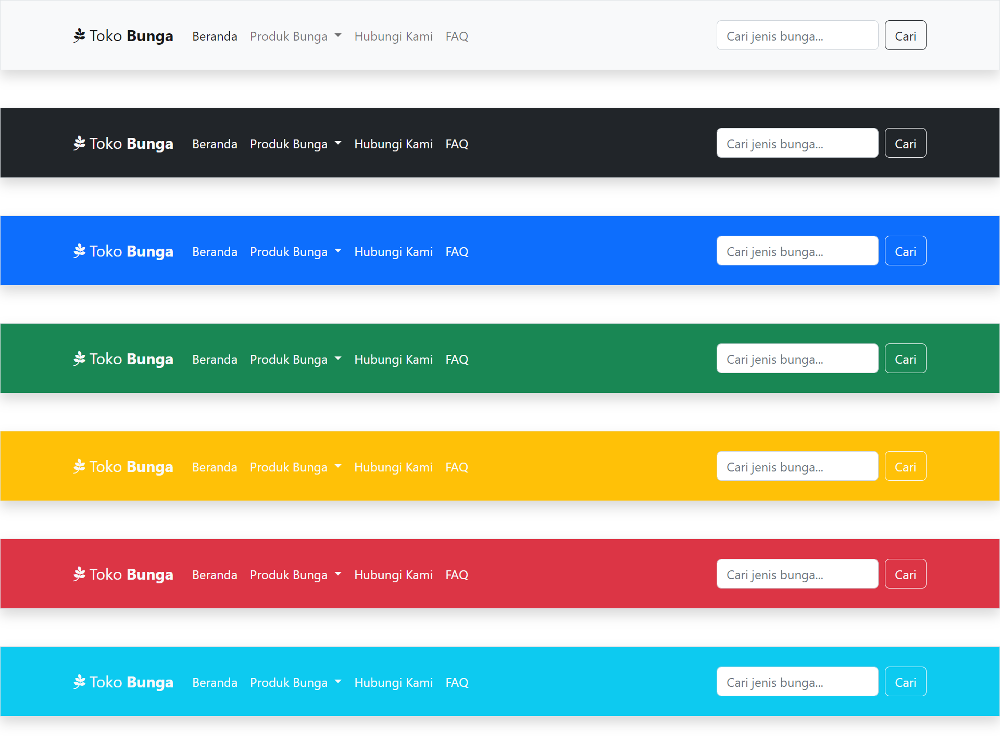

# Tutorial Youtube Belajar Bootstrap 5.x - Membuat Navbar

Navbar atau Navigation Bar merupakan bagian pada website yang digunakan untuk menempatkan menu utama atau menu navigasi ke halaman-halaman lainnya.

Melalui tutorial ini kita belajar membuat desain atau tampilan Navbar yang disediakan oleh Bootstrap 5.x.

## Hasil Desain

## Live Demo

[Tampilkan Demo](...)

## Video Tutorial di Youtube

[Tampilkan Video](...)
